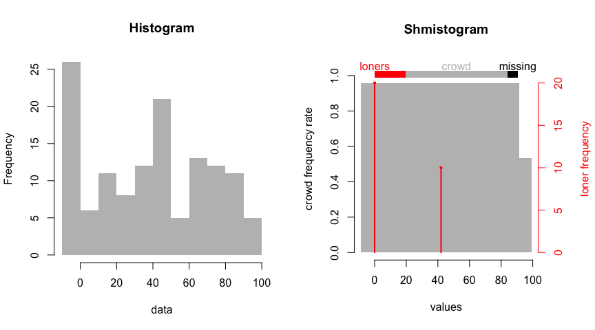
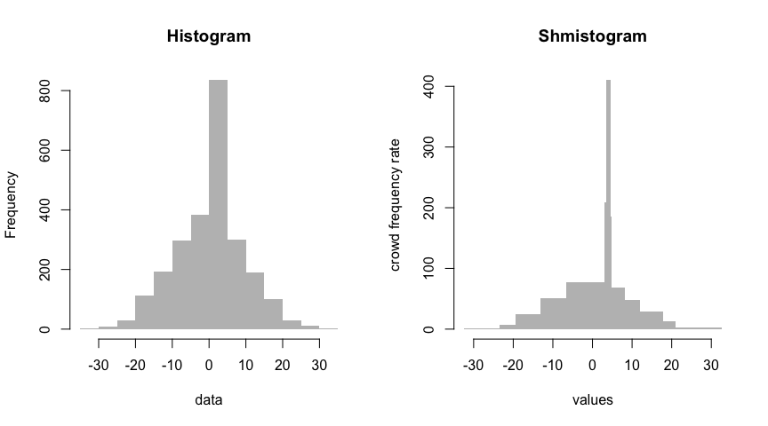

# shmistogram

The shmistogram is a better histogram. Key differences include

- estimating density with better accuracy and fewer bins than a histogram 
by hierarchically grouping points into variable-width bins
- emphasizing singular modalities (i.e. point masses) with a separate multinomial distribution

Functionality is currently split across two packages. The python shmistogram module
currently performs all binning and tabulation computations. The R package
uses reticulate to access the python module as a back-end and offers a plotting function.

## Installation

Requirements: R 3.5.2+ and python 3.6+

Clone this repo and do `python setup.py install` to install the python module. Test your installation
by running [demo.py](demo/demo.py).

Install the R package from github as 
`devtools::install_github("zkurtz/shmistogram/R-package")`. Test your installation by compiling
[demo.Rmd](demo/demo.Rmd).

Examples
--------

### Mixed data types

A shmistogram emphasizes point masses that may occur in a continuous variable, explicitly decomposing the distribution into a mixture of a multinomial and a piecewise uniform distribution. Such point masses are quite common:

-   inconsistent rounding any continuous variable can introduce a mixture of point masses and relatively continuous observations
-   "age of earning first driver's license" plausibly has structural modes at the legal minimum (which may vary by state) and otherwise vary continuously

Let's simulate a uniform distribution mixed with two point masses and a couple missing observations:

``` r
set.seed(1)
unif = runif(n=100, min=-10, max=100)
multi = c(rep(0, 20), rep(42, 10), rep(NA, 10))
data = c(unif, multi)
par(mfrow = c(1, 2))
hist(data, border=NA, col='grey', main = 'Histogram')
shmistogram::shmistogram(data)
```



The histogram obscures the point masses somewhat. By contrast, the shmistogram uses red line segments to emphasize them. The legend bar at the top shows the relative portions of the data that compose the point masses (the "loners"), the relatively continous portion (the "crowd") and the missing values.

A regularization term in the shmistogram binning algorithm (see [details](#Details)) limits the number of shmistogram bins, evidently giving it an advantage over default histogram binning when the target is a uniform density.

### Variable bin width

The shmistogram's adaptive bin width leads to a higher-fidelity representation of complicated distributions without substantially increasing the number of bins:

``` r
set.seed(0)
data = c(
    rnorm(2000, mean=0, sd=10),
    rnorm(500, mean = 4, sd = 0.5)
)
par(mfrow = c(1, 2))
hist(data, border=NA, col='grey', main = 'Histogram')
shmistogram::shmistogram(data)
```



## Details

The default binning algorithm uses a [binary density estimation tree](shmistogram/det/__init__.py) to iteratively split the data into smaller bins. The split location (within a bin/leaf) maximizes the improvement in the deviance (i.e. in-sample negative log likelihood) subject to a minimum-points-per-leaf constraint. This minimum currently defaults to 3. 

We choose the bin to split on as the bin for which splitting leads to the greatest improvement in deviance. Splits proceed as long as the deviance improvement exceeds the number of leaves. This approach is inspired by the Akaike information criterion (AIC), although this may be an abuse of the criterion in the sense that we're using it as part of a greedy iterative procedure instead of using it to compare fully-formed models. 

For more about density estimation trees, see
- [density estimation trees](https://mlpack.org/papers/det.pdf) 
such as [this](https://gitlab.cern.ch/landerli/density-estimation-trees) or
- [distribution element trees](https://arxiv.org/pdf/1610.00345.pdf) such as 
[detpack](https://github.com/cran/detpack/blob/master/R/det1.R). Interestingly, calling `det1(x, mode=1)` on data x also produces a variable bin-width histogram.

## Disclaimer

This repo is young, currently has no unit tests, and should be expected to change substantially. Use with caution.
