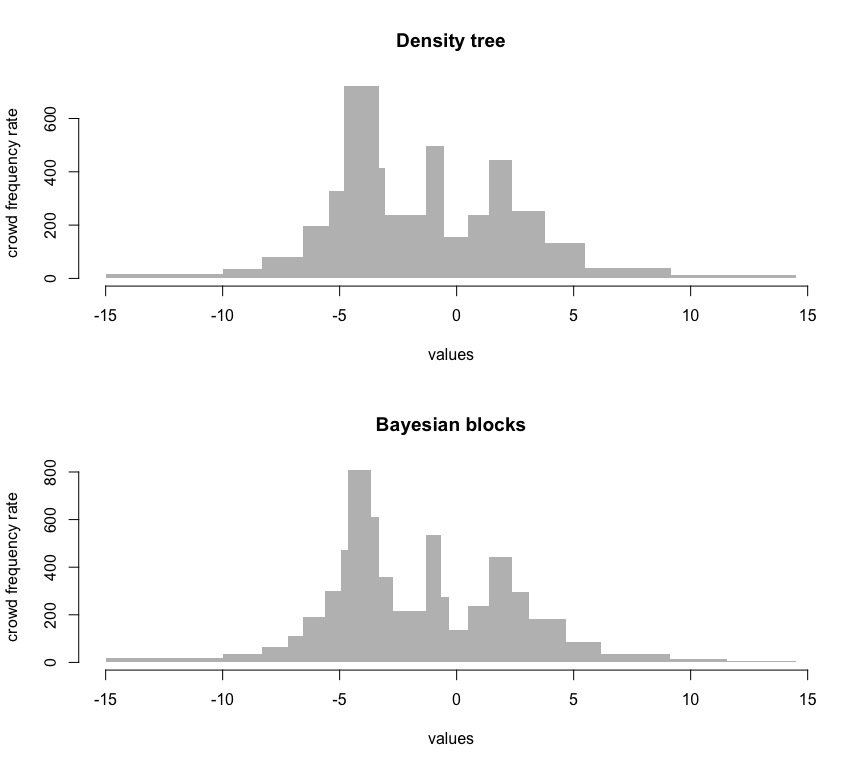
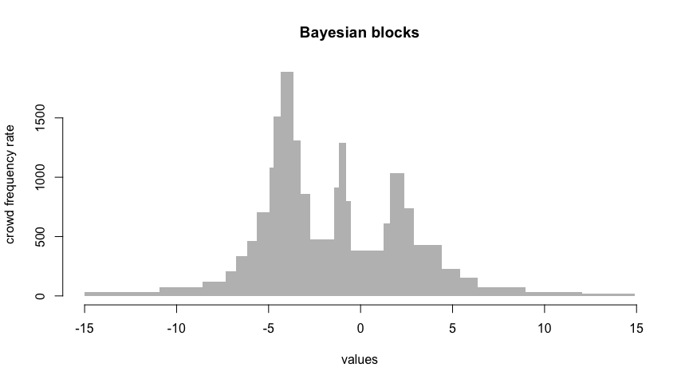

Examples
--------

### Cauchy Mixture

``` r
library(shmistogram)
set.seed(0)
py = reticulate::import("shmistogram")
data = py$simulations$cauchy_mixture(10000L)
det = shmistogram(
    data, 
    params=list(
        binning_method='density_tree',
        binning_params=list(
            #lambda=0.5, 
            n_bins=26),
        verbose=TRUE
    ),
    plotting_params=list(main="Density tree"),
    return_data=TRUE
)
```

    ## tabulation seconds elapsed: 0.01 seconds
    ## binning seconds elapsed: 1.53 seconds



``` r
bayb = shmistogram(data, 
    params=list(
        binning_method='bayesian_blocks',
        binning_params=list(gamma=0.005), # smaller gamma -> fewer bins
        verbose=TRUE
    ),
    plotting_params=list(main="Bayesian blocks"),
    return_data=TRUE
)
```

    ## tabulation seconds elapsed: 0.01 seconds
    ## binning seconds elapsed: 1.86 seconds



``` r
stopifnot(nrow(det$data$crowd) == nrow(bayb$data$crowd))
```
