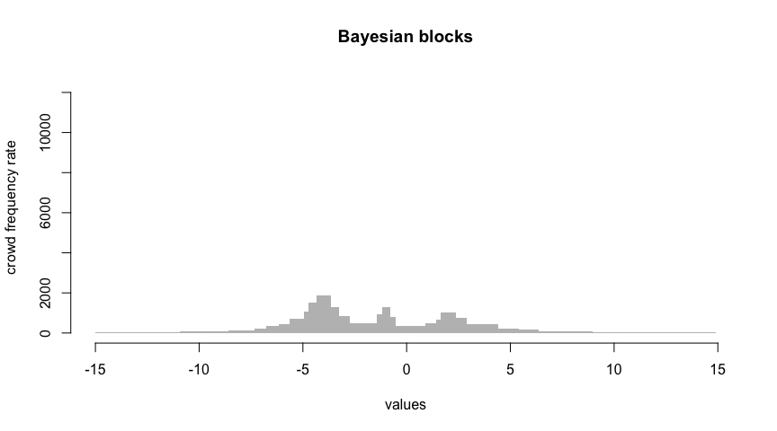

Bayesian blocks: extreme spiking
--------------------------------

Here is an example of a Bayesian blocks call that leads to poor visualization properties:

``` r
library(shmistogram)
set.seed(0)
py = reticulate::import("shmistogram")
data = py$simulations$cauchy_mixture(10000L)
bayb = shmistogram(data, 
    params=list(
        binning_method='bayesian_blocks',
        verbose=TRUE
    ),
    plotting_params=list(main="Bayesian blocks"),
    return_data=TRUE
)
```

    ## tabulation seconds elapsed: 0.02 seconds
    ## binning seconds elapsed: 1.91 seconds



The problem is clear upon examining the underlying bins: The potential for an extremely narrow bin creates the risk of exploding the density. Notice the bin with only 3 observations.

``` r
round(bayb$data$crowd, 2)
```

    ##        lb     ub freq width     rate
    ## 1  -14.99 -10.92  130  4.07    31.95
    ## 2  -10.92  -8.60  162  2.33    69.63
    ## 3   -8.60  -7.32  151  1.27   118.72
    ## 4   -7.32  -6.76  116  0.56   207.61
    ## 5   -6.76  -6.18  195  0.58   333.75
    ## 6   -6.18  -5.65  246  0.53   460.51
    ## 7   -5.65  -4.94  497  0.71   701.69
    ## 8   -4.94  -4.72  234  0.22  1081.37
    ## 9   -4.72  -4.32  600  0.40  1510.67
    ## 10  -4.32  -3.64 1290  0.68  1888.58
    ## 11  -3.64  -3.25  517  0.39  1311.68
    ## 12  -3.25  -2.72  450  0.52   857.51
    ## 13  -2.72  -1.42  621  1.30   478.20
    ## 14  -1.42  -1.16  243  0.27   912.95
    ## 15  -1.16  -0.79  476  0.37  1290.76
    ## 16  -0.79  -0.53  203  0.25   796.37
    ## 17  -0.53   0.88  513  1.42   362.35
    ## 18   0.88   1.44  279  0.56   498.38
    ## 19   1.44   1.44    3  0.00 12581.68
    ## 20   1.44   1.62  115  0.18   649.62
    ## 21   1.62   2.40  804  0.78  1035.46
    ## 22   2.40   2.88  358  0.49   737.83
    ## 23   2.88   4.39  654  1.51   431.94
    ## 24   4.39   5.43  237  1.04   228.32
    ## 25   5.43   6.38  144  0.94   152.43
    ## 26   6.38   8.95  184  2.57    71.51
    ## 27   8.95  12.05  107  3.10    34.47
    ## 28  12.05  14.91   50  2.85    17.53
